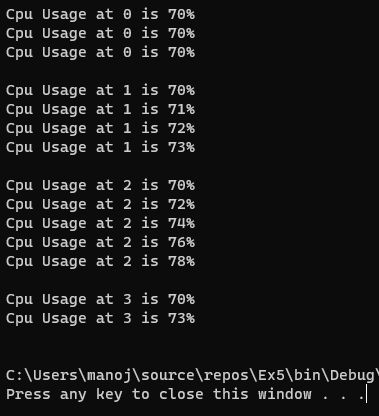

# Ex05-Rec-JaggedArray
## Aim:
To write a C# program to create a sample CPU usage on a network with 4 nodes using a jagged array.
## Algorithm:
### Step 1:
Create a new Class named cpu.
### Step 2:
Create a jagged array of 4 arrays.

int[][] array = new int[][];
### Step 3:
Create as many sub-nodes as you wish inside one node of jagged array.
### Step 4:
Give the sample CPU usage in the jagged array.
### Step 5:
Print the sample CPU usage in the jagged array.
### Step 6:
End the Program.

## Program:
```
Developed By: Manoj Kumar S
Register No: 212221230056
```
```c#
using System;
namespace ex5
{
   class Program
    {
        static void Main(string[] args)
        {
            int[][] arr = new int[4][];
            {
                arr[0]=new int[3];
                arr[1]=new int[4];
                arr[2]=new int[5];
                arr[3]=new int[2];
                for(int i=0; i < 4; i++)
                {
                    for(int j=0; j < arr[i].Length; j++)
                    {
                        arr[i][j]= i * j + 70;
                    }
                }
                for (int i = 0; i < 4; i++)
                {
                    for (int j = 0; j < arr[i].Length; j++)
                    {
                        Console.WriteLine("Cpu Usage at "+i +" is "+ arr[i][j]+"%" );
                    }
                    Console.WriteLine();
                }
            }
        }
    }
}
```

## Output:

## Result:
Thus,C# program to create a sample CPU usage on a network with 4 nodes using a jagged array is executed successfully.